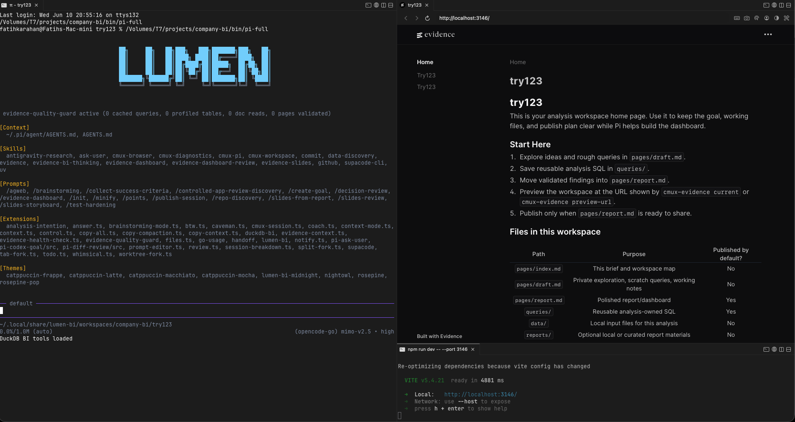
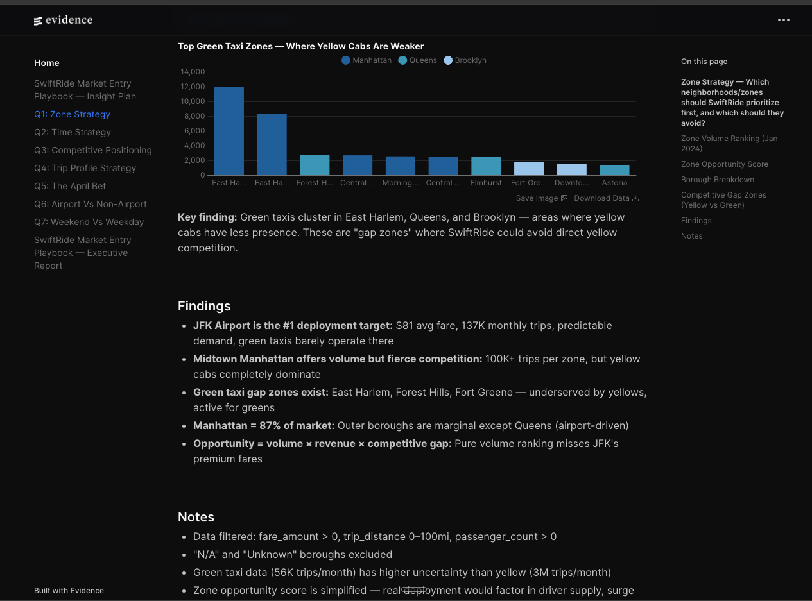
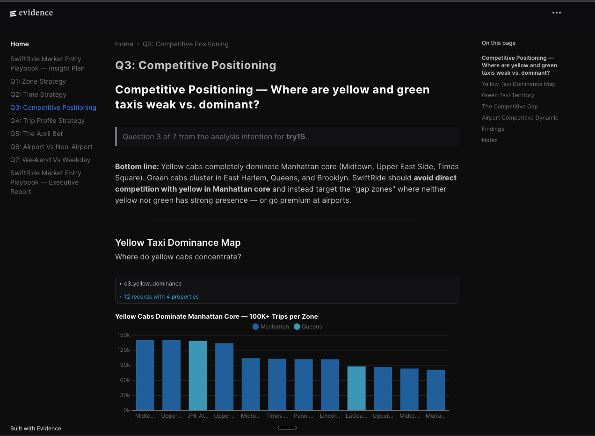
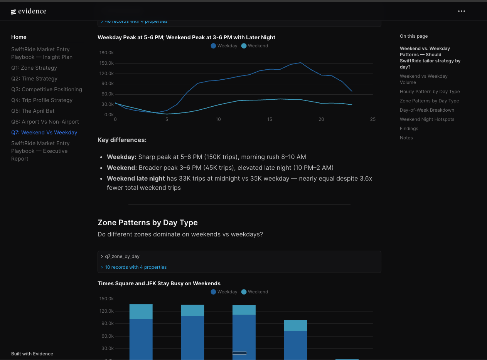

# Company BI — LUMEN

> A local-first BI development environment where an AI agent builds
> Evidence dashboards inside a three-pane workspace. Ask questions in
> natural language, explore data with DuckDB, and see live dashboard
> results — all in one workspace.

## What is this?

Company BI combines three tools into a single workspace:

- **Evidence** renders dashboards from Markdown + SQL
- **Pi** is a coding agent that edits pages, writes queries, and inspects the browser preview
- **CMUX** provides the three-pane workspace: Pi agent | browser preview | dev server

You describe what you want to analyze. The agent explores your data,
builds charts and KPIs, and you see the results live. When the dashboard
is ready, you publish it.

## Quick start

```bash
# 1. Install
npm install

# 2. Create an analysis workspace
./bin/cmux-evidence new "Sales performance"

# 3. Drop your data files into the workspace
cp ~/your-data/orders.csv ~/.local/share/lumen-bi/workspaces/company-bi/sales-performance/data/
cp ~/your-data/customers.csv ~/.local/share/lumen-bi/workspaces/company-bi/sales-performance/data/

# 4. Register your data
cd ~/.local/share/lumen-bi/workspaces/company-bi/sales-performance
./bin/cmux-evidence data refresh

# 5. Open the workspace and ask Pi to analyze
./bin/cmux-evidence open sales-performance
# Then in Pi: "Analyze revenue by customer segment and region"
```

## How it works

### The workspace

When you create an analysis, you get a clean content workspace:

```text
pages/index.md      ← workspace brief and goal
pages/draft.md      ← private exploration sandbox
pages/report.md     ← polished dashboard (published)
queries/             ← reusable analysis SQL
data/                ← your local data files (CSV, Parquet, JSON, etc.)
reports/             ← published report output
.cmux/               ← workspace metadata + data registry
```

The Evidence app, node_modules, extensions, and runtime code live in a
separate hidden directory. You never see or edit them.

### Supported data formats

| Format | Extension | Example |
|--------|-----------|---------|
| CSV | `.csv` | `orders.csv` |
| TSV | `.tsv` | `events.tsv` |
| Parquet | `.parquet` | `sales.parquet` |
| JSON | `.json` | `config.json` |
| JSON Lines | `.jsonl` | `logs.jsonl` |

### The data registry

When you run `cmux-evidence data refresh`, the system:

1. Scans your `data/` directory for supported files
2. Creates stable table aliases (e.g., `data/orders.csv` → `files.orders`)
3. Generates Evidence source SQL in the shadow runtime
4. Registers everything in `.cmux/data-registry.json`

Dashboard pages then use stable source names:

```sql
-- ✅ Correct — uses registered source name
SELECT region, SUM(revenue) FROM files.orders GROUP BY 1

-- ❌ Wrong — raw file path (won't work in Evidence pages)
SELECT region, SUM(revenue) FROM read_csv_auto('data/orders.csv') GROUP BY 1
```

### The workflow

```text
1. Create    → cmux-evidence new "Revenue by Region"
2. Add data  → copy CSV/Parquet/JSON files into data/
3. Register  → cmux-evidence data refresh
4. Explore   → agent queries data, you see charts in the browser
5. Refine    → agent builds draft, you give feedback
6. Publish   → cmux-evidence publish (report + queries → review branch)
```

### The three-pane workspace

```text
┌─────────────┬──────────────────────┐
│ Pi Agent    │ Evidence Preview     │
│ (terminal)  │ (browser)            │
│             ├──────────────────────┤
│             │ Evidence Dev Server  │
│             │ (terminal/logs)      │
└─────────────┴──────────────────────┘
```

The agent can see the browser preview and validate rendering before
telling you the dashboard is ready.



## What makes this different

### Insight-first methodology

Before writing any chart, the agent generates an Insight Candidate Scan
— a structured list of analytical moves (trend, distribution, outlier,
benchmark, funnel, cohort) with business questions, query shapes, and
decisions on what to keep, explore, or drop. Then it writes a Report
Design Plan. Charts come last.

### Quality guards that prevent silent failures

Evidence dashboards fail silently more often than they crash. The build
succeeds, exit code is 0, but charts render empty because SQL returned
no data. The quality guard extension catches this:

- **Query validation** — SQL must be tested via DuckDB before page writes
- **Empty dataset detection** — queries must return rows
- **Static analysis** — catches Svelte/HTML rendering issues (dangerous `<` in text, invalid HTML entities, component prop mismatches)
- **Rendering guard** — detects Vite error overlays and broken builds before taking screenshots

### Content-only workspaces

Each analysis is a clean content directory. No Git branch, no full
project checkout. The user edits pages and queries. The runtime is
generated and disposable. Publishing materializes only the report and
queries — drafts, local data, and scratch files stay private.

### Agent-visible preview

The agent can inspect the Evidence browser preview: take snapshots,
detect rendering errors, validate chart appearance. This closes the loop
between "I wrote a chart" and "the chart looks right."

## Commands

### Data management

```bash
./bin/cmux-evidence data list               # show registered tables
./bin/cmux-evidence data refresh            # scan files, update registry, generate sources
```

### Create and open

```bash
./bin/cmux-evidence new "Analysis Title"    # create workspace + open in CMUX
./bin/cmux-evidence open <slug>             # reopen an existing workspace
./bin/cmux-evidence list                    # list all workspaces
```

### Inside a workspace

```bash
./bin/cmux-evidence validate                # check build health
./bin/cmux-evidence diff                    # content diff
./bin/cmux-evidence publish                 # publish report for review
```

### Browser preview (inside CMUX)

```bash
./bin/cmux-evidence preview-url             # get preview URL
./bin/cmux-evidence preview-screenshot <surface-ref> /tmp/preview.png
```

## Project structure

```text
bin/
  cmux-evidence              CLI — workspace lifecycle (new/open/validate/publish/data)
  pi-full                    Pi agent launcher (local + global resources)
  lumen-pi                   Pi launcher (isolated, no global resources)

pi-pkg/                      Pi package — extensions, skills, prompts, themes
  extensions/                7 Evidence-aware extensions
  skills/                    15 specialized workflow skills
  prompts/                   Prompt templates
  themes/                    LUMEN midnight theme

scripts/
  workspace_data_registry.py Core registry logic (scan, refresh, source generation)
  ensure_workspace_sources.sh Generic source bootstrap (replaces TLC-specific script)
  run_evidence_dev.sh        Dev server launcher

sources/                     Evidence source SQL
pages/                       Evidence dashboard pages

examples/
  tlc/                       Optional demo data (NYC TLC taxi trips)
  swiftride/                 Showcase: complete market entry analysis + slides
```

## Extensions

| Extension | What it does |
|-----------|-------------|
| `evidence-context` | Injects workspace state, source catalog, and data registry into each agent turn |
| `analysis-intention` | Iterative interview to capture the analysis goal, questions, and success criteria |
| `duckdb-bi` | DuckDB tools for safe, audited data exploration + workspace data registry reader |
| `evidence-quality-guard` | Multi-layer validation to prevent silent dashboard failures |
| `evidence-health-check` | Dev server health checker — catches build errors before screenshots |
| `lumen-bi` | LUMEN branded TUI header |
| `pi-ask-user` | Interactive Q&A primitive for high-stakes decisions |

## Skills

| Skill | When to use |
|-------|-------------|
| `evidence-dashboard` | Building or revising an Evidence dashboard (6-phase workflow) |
| `evidence-bi-thinking` | Deciding what charts to build, generating insight candidates |
| `evidence-dashboard-review` | Reviewing and critiquing a dashboard |
| `evidence-slides` | Turning a report into a presentation deck |
| `data-discovery` | Profiling and exploring data sources |
| `ask-user` | Decision gate for high-stakes choices |
| `evidence` | Evidence component patterns and syntax reference |
| `cmux-workspace` | CMUX workspace automation (panes, surfaces, sidebar) |
| `cmux-browser` | Browser automation (snapshot, click, fill, wait) |
| `cmux-settings` | CMUX configuration management |
| `cmux-customization` | Actions, commands, layouts, tab bars, Dock |
| `cmux-keyboard-shortcuts` | Shortcut bindings and templates |
| `cmux-markdown` | Markdown viewer panels with live reload |
| `cmux-pi` | Pi + CMUX integration (session restore, notifications) |
| `cmux-diagnostics` | Health checks for CLI, socket, hooks, settings |

## Prerequisites

- Node.js and npm
- CMUX CLI (`cmux`)
- Pi Coding Agent (`pi`)
- Git
- Optional: GitHub CLI (`gh`) for PR creation

## Install

```bash
npm install
```

## Run the root Evidence app

```bash
npm run dev
```

Opens at <http://localhost:3000>.

## Showcase: SwiftRide NYC Market Entry Playbook

A complete, real-world analysis produced in a **single goal-driven session**.
A ride-hailing startup (SwiftRide) needed a data-driven market entry
strategy for NYC. Using 9M+ taxi trips from Jan–Mar 2024, the agent
answered 7 strategic questions, built an executive report, and generated
a 17-slide presentation deck — all without manual intervention between steps.

### What was produced

| Output | Description |
|--------|-------------|
| 7 analysis pages | Zone strategy, time strategy, competitive positioning, trip profiles, April trends, airport analysis, weekend patterns |
| Executive report | 50-driver deployment playbook with risk register and Plan B |
| Slide deck | 17-slide self-contained HTML presentation (1920×1080, keyboard nav) |
| Storyboard | Slide-by-slide narrative with evidence traceability to source queries |

### Dashboard screenshots

**Q1: Zone Strategy** — Green taxi gap zones where yellow cabs are weaker:



**Q3: Competitive Positioning** — Yellow taxi dominance across Manhattan:



**Q7: Weekend vs Weekday** — Hourly demand curves showing different patterns:



### How it was produced

The analysis was generated using Pi's **goal feature** — a one-shot workflow
where the agent receives a detailed objective with acceptance criteria and
runs to completion:

```text
/create-goal "Complete all 7 SwiftRide market entry questions (Q1–Q7)
with data-backed findings, synthesize into report.md, and generate
a self-contained HTML slide deck following the evidence-slides skill."
```

The goal intake captures success criteria, verification evidence,
constraints, and blocked-stop conditions. The agent iterates through
the questions, validates SQL, checks dashboard health, and produces
the final deck — stopping only when every criterion is met.

See [`examples/swiftride/`](examples/swiftride/) for the full artifact set
including the report, slides, storyboard, and goal intake document.

## Examples

See `examples/` for optional demo datasets and showcase analyses:

- [`examples/tlc/`](examples/tlc/) — NYC TLC taxi trip data (optional demo dataset)
- [`examples/swiftride/`](examples/swiftride/) — Complete SwiftRide market entry analysis (showcase)

## Local generated state

These are local-only and ignored by Git:

```text
.cmux/registry.json
.cmux/workspace.json
.cmux/data-registry.json
.evidence/
build/
node_modules/
```
